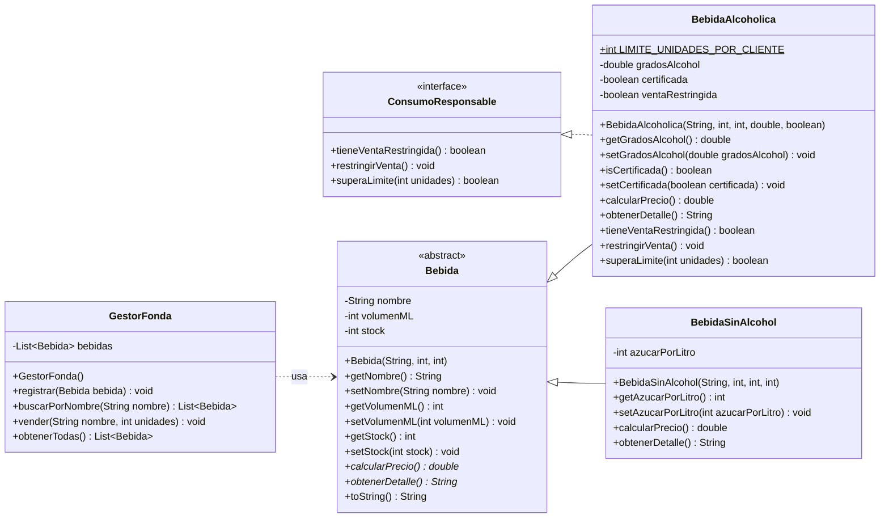

# Tarea Fiestas Patrias — Fonda San Belarmino

**DSY1102 · Programación Orientada a Objetos · EA1: Fundamentos de Programación Orientada a Objetos**

> Material de práctica. No corresponde a una evaluación sumativa.

| | |
|---|---|
| **Sigla** | DSY1102 |
| **Experiencia de aprendizaje** | EA1: Fundamentos de Programación Orientada a Objetos |
| **Indicadores de logro** | IL 1.1 al IL 1.6 |
| **Tiempo estimado** | 3 bloques |
| **Modalidad** | Individual, con acompañamiento docente |
| **Lenguaje** | Java |

---

## Cómo trabajar con este repositorio

Este repositorio es público y está pensado para que cada estudiante trabaje sobre su propia copia.

1. Pulsa **Fork** (arriba a la derecha) para crear el repositorio en tu propia cuenta de GitHub.
2. Clona tu fork:
   ```bash
   git clone https://github.com/TU_USUARIO/fonda-san-belarmino.git
   cd fonda-san-belarmino
   ```
3. Abre la carpeta desde tu IDE como **proyecto Maven** (IntelliJ IDEA y NetBeans lo detectan solo al encontrar el `pom.xml`).
4. Escribe tus clases dentro de `src/main/java/cl/dsy1102/fonda`.
5. Haz commits a medida que avanzas. El historial también sirve como evidencia de tu proceso.

### Requisitos

| Herramienta | Versión |
|---|---|
| JDK | 21 o superior |
| Maven | 3.9 o superior (IntelliJ IDEA y NetBeans traen uno incorporado) |

### Comandos

```bash
mvn compile              # compila el proyecto
mvn compile exec:java    # compila y ejecuta la clase Main
mvn clean                # borra los archivos compilados
```

Cada push a tu fork dispara una verificación automática de compilación en GitHub Actions. Si el check aparece en verde, tu código compila; si aparece en rojo, abre el log y revisa el error. Recuerda que una solución que no compila no permite evidenciar los indicadores de logro.

---

## Condiciones de la actividad

### Del propósito de la actividad

- Esta tarea no tiene nota propia. Su propósito es que identifiques, antes de la evaluación sumativa, cuáles elementos de la Programación Orientada a Objetos ya dominas y cuáles necesitas reforzar.
- Puedes consultar tus apuntes, el material de la asignatura, la documentación oficial de Java y al docente durante toda la sesión.
- Trabaja de forma individual para que la retroalimentación refleje tu propio avance. Puedes comentar dudas con tus compañeros, pero el código que entregues debe ser tuyo.
- Avanza en el orden en que se presentan los requerimientos. Si no alcanzas a completar todo, entrega igualmente lo que lograste: un avance parcial también permite retroalimentar.
- Si tu programa no compila, no lo descartes. Guarda el mensaje de error y consúltalo: interpretar ese error en clase es parte del objetivo de la actividad.

### De tu solución

- El código debe organizarse en clases separadas, respetando las convenciones de nomenclatura de Java: `PascalCase` para nombres de clase, `camelCase` para métodos y atributos.
- Puedes crear métodos o clases auxiliares siempre que no contradigan los requerimientos del caso.
- No uses herramientas de inteligencia artificial para generar el código. El valor de esta actividad está en detectar tus propios vacíos, y un código que no escribiste no entrega esa información.
- Esta tarea no se califica con nota. Lo que se registra es el nivel alcanzado en cada criterio de la rúbrica, para orientar el trabajo de las próximas sesiones.

---

## Entrega y retroalimentación

- Comprime el proyecto completo (todas las clases) en un único archivo ZIP. Desde tu fork puedes usar **Code → Download ZIP**.
- Nombra el archivo con tu nombre completo, sin espacios ni tildes (ejemplo: `Juan_Perez_Lopez.zip`).
- Incluye en el comentario de la entrega el enlace a tu fork.
- Sube el archivo a la actividad habilitada en AVA al cierre de la sesión, aunque tu solución esté incompleta.
- Antes de entregar, revisa tu solución con la rúbrica de retroalimentación y marca en qué nivel crees estar en cada criterio.
- Recibirás retroalimentación criterio por criterio según la rúbrica de la actividad. Úsala para preparar la evaluación sumativa de la experiencia.

---

## 1. Contexto del caso

La Fonda San Belarmino requiere un sistema para administrar las bebidas que ofrece durante las Fiestas Patrias y registrar el precio de venta de cada una. La fonda trabaja con bebidas alcohólicas y sin alcohol; aunque todas comparten información básica como nombre, volumen y stock, el precio de venta varía según el tipo de bebida. Adicionalmente, las bebidas alcohólicas están sujetas a un control de consumo responsable que limita la cantidad de unidades que puede llevar un mismo cliente, lo que implica gestionar su disponibilidad de forma diferenciada.

El sistema debe modelar esta situación aplicando los principios de la Programación Orientada a Objetos, de manera que el comportamiento compartido y el comportamiento específico de cada tipo de bebida queden correctamente organizados en la jerarquía de clases.

### Diagrama de clases



---

## 2. Información necesaria

El sistema contempla las entidades que se muestran en el diagrama. Cada clase debe incluir constructor(es), métodos accesadores (getters), mutadores (setters) y el método **`toString()`: el cual debe incluir únicamente el nombre y el volumen de la bebida**. Los constructores deben delegar la asignación de valores a los métodos setter, de modo que las validaciones definidas se apliquen desde la construcción del objeto.

- Todas las **bebidas** del sistema comparten nombre, volumen en mililitros y stock. Dado que el precio de venta se determina de manera diferente para cada tipo de bebida, el sistema debe contemplar un mecanismo que permita calcular ese precio de forma general sin conocer el tipo específico del objeto en cada momento.
- Las **bebidas alcohólicas** agregan los grados de alcohol, si cuentan con certificación del proveedor y un indicador de venta restringida. Al participar en el control de consumo responsable de la fonda, deben implementar el contrato definido por la interfaz **`ConsumoResponsable`**.
- Las **bebidas sin alcohol** agregan un atributo que indica su contenido de azúcar en gramos por litro, condición que incide en el precio de venta.
- El **gestor de la fonda** es la clase responsable de administrar la colección de bebidas registradas y exponer las operaciones sobre ella.

---

## 3. Métodos especializados

El sistema debe ser capaz de calcular el precio de venta para cualquier bebida registrada, independientemente del tipo. Cada tipo de bebida determina ese precio según su propia lógica:

- **Bebida Alcohólica:** el precio base es $3.500. Si la bebida no cuenta con certificación del proveedor, ese precio se incrementa en un 20%.
- **Bebida Sin Alcohol:** el precio base es $2.000. Si el contenido de azúcar supera los 80 g/L, el precio se incrementa en un 10%.
- **Ficha de detalle:** además del precio, cada tipo de bebida debe entregar su propia ficha con todos sus datos, incluidos los del subtipo. Ese método también se resuelve por sobrescritura y es el que utiliza la búsqueda, mientras que `toString()` se reserva para el listado resumido.

La interfaz `ConsumoResponsable` define el contrato que deben cumplir las bebidas sujetas al control de consumo responsable de la fonda. Está compuesta por tres operaciones:

1. La primera permite consultar en cualquier momento si la bebida tiene la venta restringida.
2. La segunda permite registrar que la bebida queda con la venta restringida.
3. La tercera permite determinar si una cantidad de unidades solicitada supera el máximo permitido por cliente. Ese máximo es el mismo para todas las bebidas alcohólicas (3 unidades) y no cambia durante la ejecución, por lo que debe declararse como una constante de clase y no como un atributo de instancia.

Esta interfaz está diseñada de manera que, en el futuro, cualquier otro producto de la fonda pueda incorporarse al control de consumo sin necesidad de modificar la jerarquía de clases existente. Por ahora, solo las bebidas alcohólicas implementan este contrato.

---

## 4. Validaciones esperadas

Las validaciones deben aplicarse en los métodos setter de cada clase. Cuando una condición no se cumpla, debe lanzarse una excepción de tipo **`IllegalArgumentException`** con un mensaje descriptivo que explique el motivo del rechazo.

| Atributo | Regla |
|---|---|
| `nombre` | No puede ser nulo ni vacío. |
| `volumen` | Debe encontrarse en el rango entre 100 y 3.000 mililitros. |
| `stock` | Debe ser un valor mayor que cero. |
| `gradosAlcohol` (solo en la bebida alcohólica) | Debe encontrarse en el rango entre 0,5 y 45. |

---

## 5. Operaciones del sistema

La clase que gestiona la colección de bebidas debe exponer las siguientes operaciones:

- **Registrar** una bebida en la colección e informar por consola que fue incorporada correctamente.
- **Buscar** y retornar las bebidas cuyo nombre coincida con el criterio de búsqueda recibido.
- **Vender** una cantidad de unidades de una bebida identificada por su nombre. Si la bebida participa del control de consumo responsable, la venta debe rechazarse cuando esté restringida o cuando las unidades solicitadas superen el máximo permitido; en cualquier otro caso debe informar por consola el total a pagar. El gestor no puede preguntar por el tipo concreto de la bebida: debe resolverlo a través del contrato definido por la interfaz.

---

## 6. Requerimientos de la clase principal

La clase principal debe demostrar el funcionamiento completo del sistema e incluir los siguientes elementos:

- Instanciar una bebida de cada tipo disponible utilizando los datos de la tabla siguiente.
- Marcar la bebida alcohólica `Chicha` con la venta restringida una vez creada.
- Registrar todas las bebidas en el gestor del sistema.
- Solicitar al gestor cuatro ventas, en este orden: 2 unidades de `Pisco Sour`, 5 unidades de `Pisco Sour`, 1 unidad de `Chicha` y 6 unidades de `Mote con Huesillo`.
- Invocar las operaciones del gestor y mostrar sus resultados: buscar por nombre y listar todas las bebidas registradas mediante el método `toString()` de cada objeto.

### Datos para la clase principal

| Tipo | Nombre | Volumen (ml) | Stock | Atributo específico |
|---|---|---|---|---|
| Bebida Alcohólica | Chicha | 1000 | 40 | Grados: 12.0 · Certificada: false · Venta: Restringida |
| Bebida Alcohólica | Pisco Sour | 500 | 25 | Grados: 18.0 · Certificada: true |
| Bebida Sin Alcohol | Chicha | 1000 | 60 | Azúcar: 95 g/L |
| Bebida Sin Alcohol | Mote con Huesillo | 400 | 50 | Azúcar: 70 g/L |

---

## 7. Resultado esperado

La ejecución del programa con los datos indicados debe producir una salida similar a la siguiente:

```text
Chicha (BebidaAlcoholica) registrada correctamente.
Pisco Sour (BebidaAlcoholica) registrada correctamente.
Chicha (BebidaSinAlcohol) registrada correctamente.
Mote con Huesillo (BebidaSinAlcohol) registrada correctamente.

=== BUSQUEDA POR NOMBRE: "Chicha" ===
Tipo: Bebida Alcoholica | Nombre: Chicha | Volumen: 1000 ml | Stock: 40 | Grados: 12.0 | Certificada: No
  Venta restringida: Si | Precio: $4200
---
Tipo: Bebida Sin Alcohol | Nombre: Chicha | Volumen: 1000 ml | Stock: 60 | Azucar: 95 g/L | Precio: $2200
---

=== VENTAS ===
Venta autorizada: 2 x Pisco Sour | Total: $7000
Venta rechazada: 5 unidades de Pisco Sour superan el limite de 3 por cliente.
Venta rechazada: Chicha tiene la venta restringida.
Venta autorizada: 6 x Mote con Huesillo | Total: $12000

=== LISTADO DE BEBIDAS ===
Nombre: Chicha | Volumen: 1000 ml
Nombre: Pisco Sour | Volumen: 500 ml
Nombre: Chicha | Volumen: 1000 ml
Nombre: Mote con Huesillo | Volumen: 400 ml

Process finished with exit code 0
```

Se aceptan pequeñas diferencias en los textos o en el formato de los números, siempre que se muestren todos los datos solicitados y que los resultados numéricos sean correctos.

---

## Estructura del proyecto

```
fonda-san-belarmino/
├── .github/
│   └── workflows/
│       └── build.yml          Verificación automática de compilación
├── src/
│   └── main/
│       └── java/
│           └── cl/dsy1102/fonda/
│               ├── Main.java              (punto de entrada, ya incluido)
│               ├── Bebida.java            ← debes crearla
│               ├── BebidaAlcoholica.java  ← debes crearla
│               ├── BebidaSinAlcohol.java  ← debes crearla
│               ├── ConsumoResponsable.java ← debes crearla
│               └── GestorFonda.java       ← debes crearla
├── .gitignore
├── LICENSE
├── pom.xml
└── README.md
```

---

## Sobre JavaFX

En experiencias de aprendizaje posteriores este mismo proyecto se extiende con una interfaz gráfica en JavaFX. El `pom.xml` ya está preparado para ese momento: contiene las dependencias `javafx-controls` y `javafx-fxml` y el plugin `javafx-maven-plugin` comentados, más una propiedad `javafx.version`. Cuando corresponda, basta con descomentar esos bloques y ejecutar `mvn javafx:run`.

No es necesario hacerlo ahora: la solución de esta tarea es de consola y no requiere ninguna dependencia externa.

Si tu JDK es la versión 25, cambia `maven.compiler.release` a `25` y `javafx.version` a `25.0.1`, de modo que ambas versiones coincidan.

---

## Licencia

Material docente publicado bajo [CC BY-NC-SA 4.0](https://creativecommons.org/licenses/by-nc-sa/4.0/deed.es). El código que escribas en tu fork es tuyo y no queda cubierto por esta licencia.
